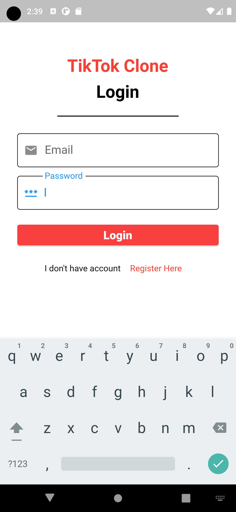
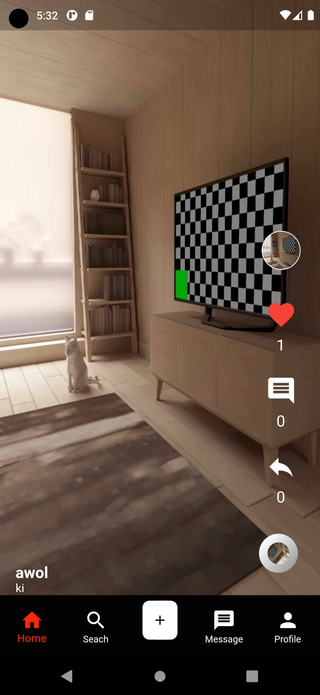

# Full Stack  Flutter TikTok Application 

## This Flutter App Developed by using the following technology
### ->flutter  Ui
### ->State Management GetX
### -> backend Firebase 
### -> MVC model Framework I used

## The Full Design Info
# Login Page
 

 
# Home Page
 

